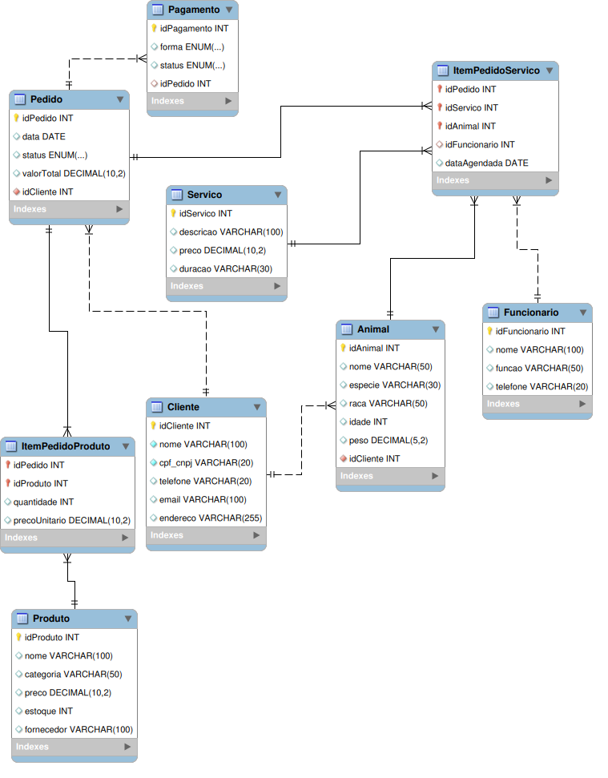

# 🐾 E-commerce PetShop - Banco de Dados

Este repositório contém o modelo de banco de dados para um sistema de e-commerce voltado ao setor pet.  
O sistema permite a venda de **produtos** e a contratação de **serviços de petshop** (banho, tosa, consulta veterinária, hospedagem).

## 📂 Arquivos incluídos
- `petshopdb.sql` → Script SQL para criação das tabelas no MySQL  
- `DER-petshop.png` → Diagrama Entidade-Relacionamento (EER) exportado do Workbench  
- `ecommerce-petshop-db.mwb` → Arquivo do projeto no MySQL Workbench  

## 📊 Modelo Conceitual


## 📝 Requisitos atendidos
- Cadastro de clientes e animais  
- Catálogo de produtos e serviços  
- Pedidos com produtos e/ou serviços  
- Registro de funcionários para atendimento de serviços  
- Controle de pagamentos e status  

## 🚀 Como executar o banco
1. Crie o schema:
   ```sql
   CREATE DATABASE petshopdb;
   USE petshopdb;
